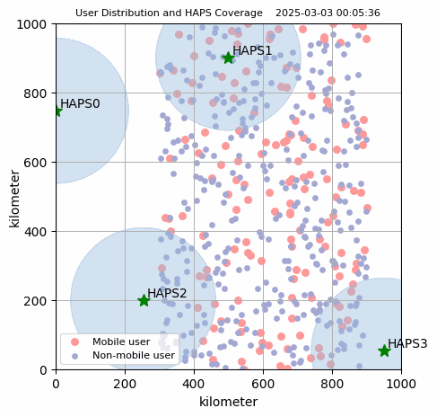

# Agent in the Sky: Intelligent Multi-Agent Framework for Autonomous HAPS Coordination and Real-World Event Adaptation

## Abstract
High Altitude Platform Station (HAPS) offers significant flexibility for dynamic adaptability and efficient user coverage. However, achieving high levels of automation in HAPS systems is fraught with challenges, particularly in comprehending complex environments and processing natural language inputs essential for autonomous operations. Existing methods, such as reinforcement learning, are task-specific and lack the ability to integrate broader environmental information. 

To address these limitations, we propose an Autonomous Coverage Multi-Agent (ACMA) framework, which leverages Large Language Models (LLMs) to enhance coverage through intelligent coordination of HAPS. By incorporating techniques like in-context learning, fine-tuning, and tool-calling, our framework enables agents to understand and respond to environmental cues and natural language instructions effectively. Simulation results demonstrate that the ACMA system outperforms traditional methods in coordinating coverage, adeptly managing dynamic incidents, and maximizing user coverage. Compared to traditional approaches, ACMA exhibits higher intelligence and autonomy, paving the way for more adaptable and efficient HAPS systems in real-world scenarios.

## Introduction
High Altitude Platform Station (HAPS) is strategically positioned within the Earth’s stratosphere, typically operating at altitudes ranging from approximately 20 to 50 kilometers. These advanced platforms fulfill a dual role: firstly, they act as wireless communication nexuses, bridging connectivity gaps between urban areas and remote regions; and secondly, they function as data repositories, supplying essential computational and storage capabilities for an integrated air-to-ground network.

The inherently dynamic characteristics of HAPS systems present a myriad of challenges contingent upon environmental fluctuations. Existing research primarily focuses on specific optimization objectives based on fixed-format inputs, which restricts the capacity to leverage diverse real-world information, such as natural language descriptions of future environmental states.

Inspired by these challenges, the proposed ACMA framework seeks to enhance HAPS systems' intelligence through leveraging LLMs for real-time decision-making and environmental adaptability.

## Visualization
Below are visual representations of the simulation:

---

